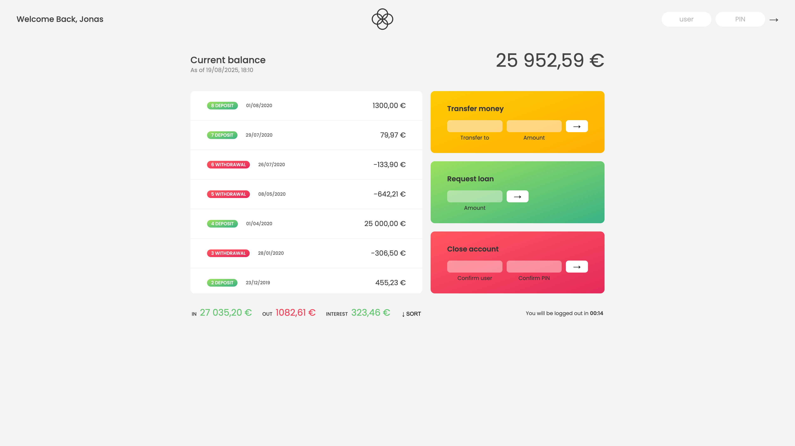
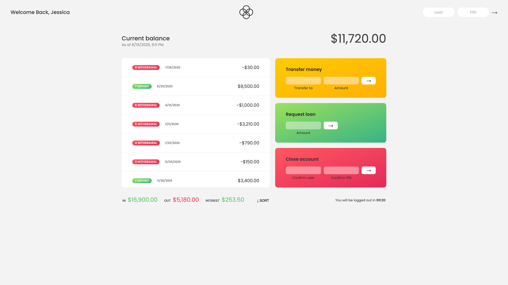

🏦 Bankist Project

A modern JavaScript-based banking web app built to practice and demonstrate the foundational skills of a great JavaScript developer. This project showcases DOM manipulation, data structures, array methods, internationalization, timers, event handling, and UI updates — everything that matters when becoming a strong frontend developer.

🚀 Core JavaScript Concepts Demonstrated

This project highlights the power of modern JavaScript through:
• DOM Manipulation – dynamically updating UI with .textContent, .innerHTML, .insertAdjacentHTML, and event listeners.
• Array Methods Mastery – forEach, map, filter, reduce, find, findIndex, some, every, flatMap, sort.
• Data Transformation – method chaining for clean, functional-style code.
• Destructuring & Spread – extracting and handling objects/arrays efficiently.
• Optional Chaining & Nullish Coalescing – safe property access and defaults.
• Internationalization API (Intl) – formatting dates & currencies based on locale.
• Timers (setTimeout, setInterval) – session handling with auto-logout.
• Clean Code Practices – scoping, functions for modularity, avoiding global pollution.

This app is more than a demo — it’s a foundation stone for writing scalable, maintainable JavaScript applications.

👤 Dummy Login Credentials

This project uses dummy data for learning purposes.
You can log in with the following accounts:
• Account 1
• Username: js
• PIN: 1111
• Account 2
• Username: jd
• PIN: 2222

🖥️ UI Walkthrough
• Welcome Message – Greets the logged-in user by their first name.
• Balance Section – Shows the total balance with currency formatting.
• Movements (Transactions) – Lists deposits & withdrawals with dates.
• Summary Section – Displays total income, outflow, and earned interest.
• Timer – Logs user out automatically after inactivity (resets on actions).

⚡ Features

✅ Login System – Secure login with username + PIN.

✅ Money Transfers – Send money to another account:
• Enter receiver username and amount.
• Only allowed if you have enough balance and can’t transfer to yourself.

✅ Request Loan – Apply for a loan:
• Granted if at least one deposit is ≥ 10% of the requested loan.
• Processed with a delay to simulate bank approval.

✅ Close Account – Permanently remove your account:
• Requires correct username and PIN confirmation.

✅ Sorting Transactions – Toggle between default and sorted order.

✅ Session Timeout –
• A countdown timer starts after login.
• Resets on actions (transfer, loan, close).
• Logs out automatically when timer hits 0.

🧩 Important Notes
• Each action (transfer, loan, close) resets the timer → keeps session alive.
• If no activity occurs → app logs out automatically.
• Switching accounts after actions shows updated transaction history.

✨ Why This Project Matters

Bankist demonstrates practical JavaScript at scale:
• Real-world data manipulation (arrays, objects, dates, currencies).
• Strong grasp of frontend fundamentals (state management, UI updates).
• Clean, maintainable code using functions & modular design.
• Mastery of JS methods that are core to becoming a modern developer.

This is not just a project — it’s a learning milestone that pushes you towards being an industry-ready JavaScript developer.

<<<<<<< HEAD
**note: Throughout the script.js file, you’ll find multiple comments I wrote for understanding and revision purposes. These comments highlight key concepts, explain tricky logic, and serve as personal notes. This approach reflects a good learning strategy—documenting the “why” behind the code to strengthen long-term understanding.**
=======
note: Throughout the script.js file, you’ll find multiple comments I wrote for understanding and revision purposes. These comments highlight key concepts, explain tricky logic, and serve as personal notes. This approach reflects a good learning strategy—documenting the “why” behind the code to strengthen long-term understanding.

.png>)
.png>)
.png>)
>>>>>>> 211ca95 (updated the readme)
